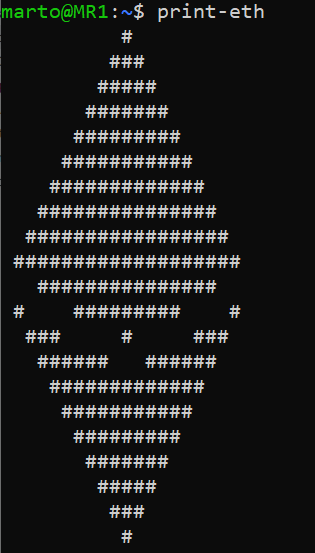
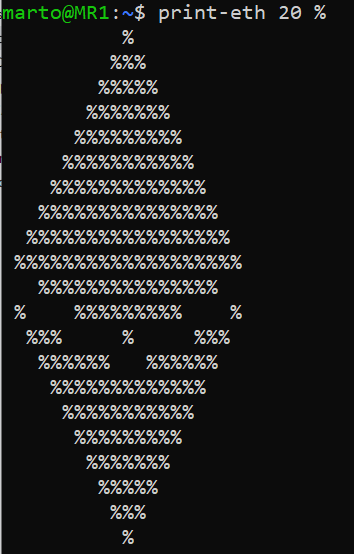
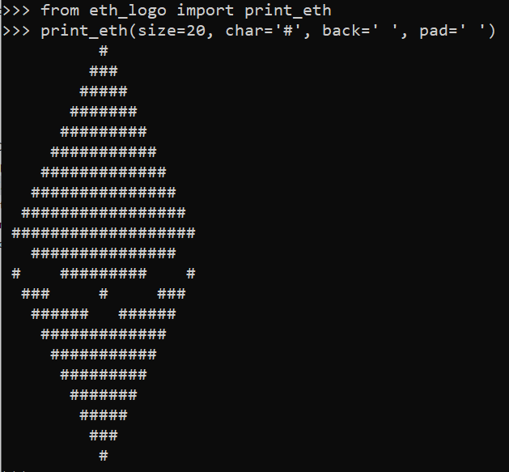

# eth-logo
[](https://badge.fury.io/py/eth-logo)
[](https://pypi.python.org/pypi/eth-logo)

Python lib to print Ethereum logo of any size and style on your terminal or standard output.

## Quickstart
```shell
pip install eth-logo
```
or 
```shell
python3 -m pip install eth-logo`
```

### Usage (in terminal)
```sh
# Optionals: print-eth SIZE CHAR [defaults: size=20 char='#']
print-eth
print-eth 30 %
```
<div align="center">
    
    
</div>


### Usage (in python)
```pycon
from eth_logo import print_eth

# Optionals: Size, Character, Background, Padding 
print_eth(size=20, char='#', back=' ', pad=' ')
```
<div align="center">
    
</div>

### Contribute
You can set up your dev environment with:
```sh
git clone git@github.com:0xMarto/eth-logo.git
cd eth-logo
virtualenv -p python3 venv
. venv/bin/activate
```
